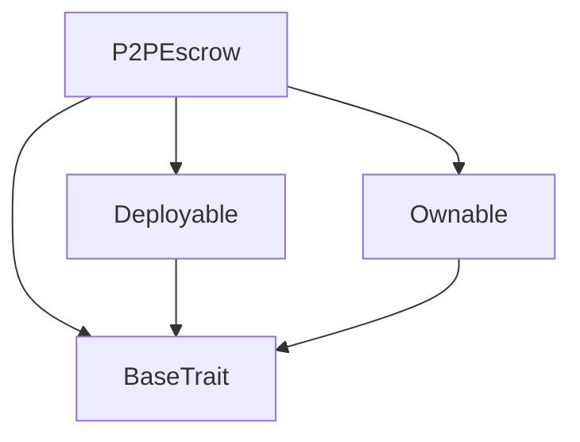
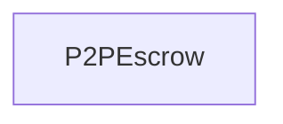

# Tact compilation report
Contract: P2PEscrow
BoC Size: 3051 bytes

## Structures (Structs and Messages)
Total structures: 33

### DataSize
TL-B: `_ cells:int257 bits:int257 refs:int257 = DataSize`
Signature: `DataSize{cells:int257,bits:int257,refs:int257}`

### SignedBundle
TL-B: `_ signature:fixed_bytes64 signedData:remainder<slice> = SignedBundle`
Signature: `SignedBundle{signature:fixed_bytes64,signedData:remainder<slice>}`

### StateInit
TL-B: `_ code:^cell data:^cell = StateInit`
Signature: `StateInit{code:^cell,data:^cell}`

### Context
TL-B: `_ bounceable:bool sender:address value:int257 raw:^slice = Context`
Signature: `Context{bounceable:bool,sender:address,value:int257,raw:^slice}`

### SendParameters
TL-B: `_ mode:int257 body:Maybe ^cell code:Maybe ^cell data:Maybe ^cell value:int257 to:address bounce:bool = SendParameters`
Signature: `SendParameters{mode:int257,body:Maybe ^cell,code:Maybe ^cell,data:Maybe ^cell,value:int257,to:address,bounce:bool}`

### MessageParameters
TL-B: `_ mode:int257 body:Maybe ^cell value:int257 to:address bounce:bool = MessageParameters`
Signature: `MessageParameters{mode:int257,body:Maybe ^cell,value:int257,to:address,bounce:bool}`

### DeployParameters
TL-B: `_ mode:int257 body:Maybe ^cell value:int257 bounce:bool init:StateInit{code:^cell,data:^cell} = DeployParameters`
Signature: `DeployParameters{mode:int257,body:Maybe ^cell,value:int257,bounce:bool,init:StateInit{code:^cell,data:^cell}}`

### StdAddress
TL-B: `_ workchain:int8 address:uint256 = StdAddress`
Signature: `StdAddress{workchain:int8,address:uint256}`

### VarAddress
TL-B: `_ workchain:int32 address:^slice = VarAddress`
Signature: `VarAddress{workchain:int32,address:^slice}`

### BasechainAddress
TL-B: `_ hash:Maybe int257 = BasechainAddress`
Signature: `BasechainAddress{hash:Maybe int257}`

### Deploy
TL-B: `deploy#946a98b6 queryId:uint64 = Deploy`
Signature: `Deploy{queryId:uint64}`

### DeployOk
TL-B: `deploy_ok#aff90f57 queryId:uint64 = DeployOk`
Signature: `DeployOk{queryId:uint64}`

### FactoryDeploy
TL-B: `factory_deploy#6d0ff13b queryId:uint64 cashback:address = FactoryDeploy`
Signature: `FactoryDeploy{queryId:uint64,cashback:address}`

### ChangeOwner
TL-B: `change_owner#819dbe99 queryId:uint64 newOwner:address = ChangeOwner`
Signature: `ChangeOwner{queryId:uint64,newOwner:address}`

### ChangeOwnerOk
TL-B: `change_owner_ok#327b2b4a queryId:uint64 newOwner:address = ChangeOwnerOk`
Signature: `ChangeOwnerOk{queryId:uint64,newOwner:address}`

### CreateOrder
TL-B: `create_order#ea68fd48 orderId:uint64 fiatAmount:uint64 fiatCurrency:uint8 paymentTimeout:uint32 = CreateOrder`
Signature: `CreateOrder{orderId:uint64,fiatAmount:uint64,fiatCurrency:uint8,paymentTimeout:uint32}`

### TakeOrder
TL-B: `take_order#e3063488 orderId:uint64 = TakeOrder`
Signature: `TakeOrder{orderId:uint64}`

### ConfirmPayment
TL-B: `confirm_payment#ff74b611 orderId:uint64 = ConfirmPayment`
Signature: `ConfirmPayment{orderId:uint64}`

### OracleConfirm
TL-B: `oracle_confirm#90209838 orderId:uint64 signature:^slice = OracleConfirm`
Signature: `OracleConfirm{orderId:uint64,signature:^slice}`

### CancelOrder
TL-B: `cancel_order#b50d6046 orderId:uint64 = CancelOrder`
Signature: `CancelOrder{orderId:uint64}`

### OpenDispute
TL-B: `open_dispute#a23676c5 orderId:uint64 reason:uint8 = OpenDispute`
Signature: `OpenDispute{orderId:uint64,reason:uint8}`

### ResolveDispute
TL-B: `resolve_dispute#ae891ed5 orderId:uint64 winner:address = ResolveDispute`
Signature: `ResolveDispute{orderId:uint64,winner:address}`

### WithdrawFees
TL-B: `withdraw_fees#eb4ab20c amount:coins = WithdrawFees`
Signature: `WithdrawFees{amount:coins}`

### UpdateOracle
TL-B: `update_oracle#40a08d51 newOracle:address = UpdateOracle`
Signature: `UpdateOracle{newOracle:address}`

### UpdateFee
TL-B: `update_fee#b2262f55 newFeePercent:uint16 = UpdateFee`
Signature: `UpdateFee{newFeePercent:uint16}`

### Order
TL-B: `_ seller:address buyer:address cryptoAmount:coins fiatAmount:uint64 fiatCurrency:uint8 status:uint8 createdAt:uint32 lockedAt:uint32 paymentTimeout:uint32 = Order`
Signature: `Order{seller:address,buyer:address,cryptoAmount:coins,fiatAmount:uint64,fiatCurrency:uint8,status:uint8,createdAt:uint32,lockedAt:uint32,paymentTimeout:uint32}`

### P2PEscrow$Data
TL-B: `_ owner:address oracle:address feePercent:uint16 collectedFees:coins orderCounter:uint64 orders:dict<int, ^Order{seller:address,buyer:address,cryptoAmount:coins,fiatAmount:uint64,fiatCurrency:uint8,status:uint8,createdAt:uint32,lockedAt:uint32,paymentTimeout:uint32}> = P2PEscrow`
Signature: `P2PEscrow{owner:address,oracle:address,feePercent:uint16,collectedFees:coins,orderCounter:uint64,orders:dict<int, ^Order{seller:address,buyer:address,cryptoAmount:coins,fiatAmount:uint64,fiatCurrency:uint8,status:uint8,createdAt:uint32,lockedAt:uint32,paymentTimeout:uint32}>}`

### OrderCreated
TL-B: `order_created#e9e53eb1 orderId:uint64 seller:address cryptoAmount:coins fiatAmount:uint64 = OrderCreated`
Signature: `OrderCreated{orderId:uint64,seller:address,cryptoAmount:coins,fiatAmount:uint64}`

### OrderTaken
TL-B: `order_taken#7fec1a91 orderId:uint64 buyer:address = OrderTaken`
Signature: `OrderTaken{orderId:uint64,buyer:address}`

### OrderCompleted
TL-B: `order_completed#2c4517ee orderId:uint64 buyer:address amount:coins = OrderCompleted`
Signature: `OrderCompleted{orderId:uint64,buyer:address,amount:coins}`

### OrderCancelled
TL-B: `order_cancelled#adf184b7 orderId:uint64 = OrderCancelled`
Signature: `OrderCancelled{orderId:uint64}`

### DisputeOpened
TL-B: `dispute_opened#323838ba orderId:uint64 openedBy:address = DisputeOpened`
Signature: `DisputeOpened{orderId:uint64,openedBy:address}`

### DisputeResolved
TL-B: `dispute_resolved#0319af9e orderId:uint64 winner:address = DisputeResolved`
Signature: `DisputeResolved{orderId:uint64,winner:address}`

## Get methods
Total get methods: 6

## getOrder
Argument: orderId

## getOrderCount
No arguments

## getCollectedFees
No arguments

## getFeePercent
No arguments

## getOracle
No arguments

## owner
No arguments

## Exit codes
* 2: Stack underflow
* 3: Stack overflow
* 4: Integer overflow
* 5: Integer out of expected range
* 6: Invalid opcode
* 7: Type check error
* 8: Cell overflow
* 9: Cell underflow
* 10: Dictionary error
* 11: 'Unknown' error
* 12: Fatal error
* 13: Out of gas error
* 14: Virtualization error
* 32: Action list is invalid
* 33: Action list is too long
* 34: Action is invalid or not supported
* 35: Invalid source address in outbound message
* 36: Invalid destination address in outbound message
* 37: Not enough Toncoin
* 38: Not enough extra currencies
* 39: Outbound message does not fit into a cell after rewriting
* 40: Cannot process a message
* 41: Library reference is null
* 42: Library change action error
* 43: Exceeded maximum number of cells in the library or the maximum depth of the Merkle tree
* 50: Account state size exceeded limits
* 128: Null reference exception
* 129: Invalid serialization prefix
* 130: Invalid incoming message
* 131: Constraints error
* 132: Access denied
* 133: Contract stopped
* 134: Invalid argument
* 135: Code of a contract was not found
* 136: Invalid standard address
* 138: Not a basechain address
* 7620: Deposit too small
* 8126: Can only cancel open orders
* 10101: Cannot buy own order
* 18518: Order not found
* 21449: Not enough fees
* 25888: Only oracle can confirm
* 27002: Invalid status
* 41074: Order not locked
* 41186: Only seller can cancel
* 44246: No buyer
* 46136: Fee too high
* 46500: Invalid winner
* 55532: Only seller can confirm
* 57383: Order not available
* 60749: Not a party
* 62062: Not disputed
* 62638: Only owner can resolve

## Trait inheritance diagram

## Contract dependency diagram

